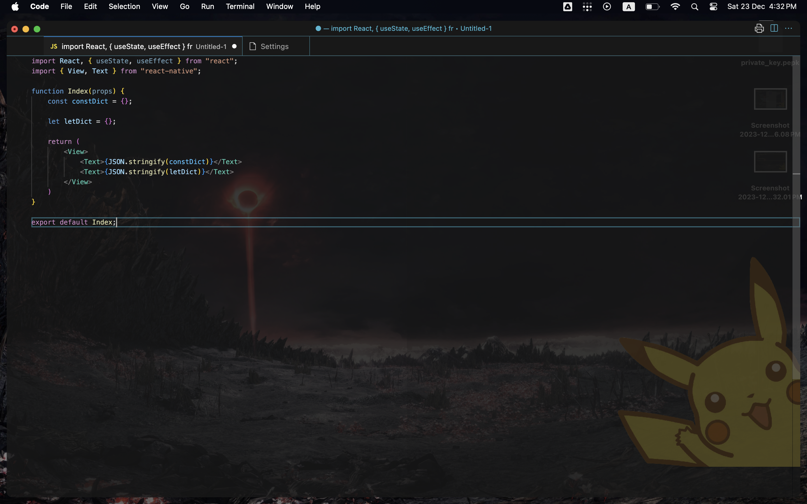
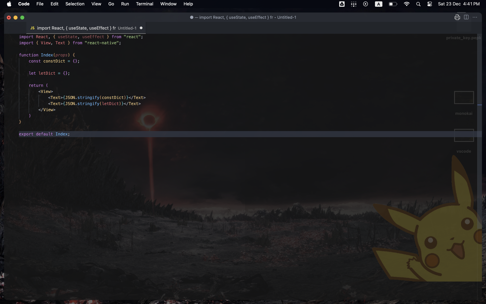
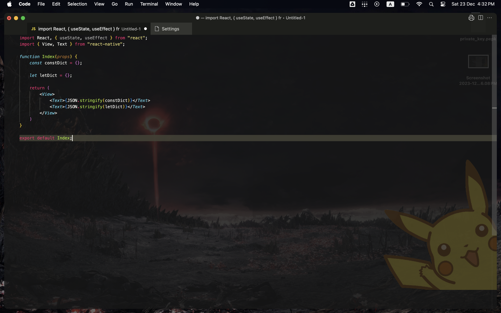

# Does Color Theme Matters? Or is is just Fluff?

2023-12-23 17:59:26

Update: Turns out VsCode uses [TextMate Grammer](https://code.visualstudio.com/api/language-extensions/syntax-highlight-guide), a proprietary syntax tree highlighter for analyzing programming languages

Hi guys, I'm a fairly new vscode user, have been using vscode on-off since college, and am really into programming in general. In my 4 years of coding experience, I have been on a quest, a quest for the greatest ide ever made, and i have tried intellij, vscode, sublime, atom and most recently, neovim.

Now, the 2 greatest contender are neovim and vscode. Why? well, they are light weight. I have a really shit computer, and I can't spare any extra ram onto IDE, which takes up 50% before I start to code. I've decided on vscode in the end, due to its remote extension capabilities. *Did you know you could code on your home desktop on a brand new ipad?* Thanks remote tunnel, you really killed all your competitors ngl.

Anyway, I still can't really let go of neovim, because, its vim, ya know, gotta pay respect to the OG. I like all my ide to be similar, like same color scheme, same panel view yada yada. Vscode Dark modern them is the one i like best, mostly due to its linting. Take a look at this sample react code, I drafted for this.

I really, really like this theme. But i couldnt put a finger on it. Was it the colorscheme? Was it the vibrant colors? The issues lies in, I couldnt install this theme on neovim, the closest i could find was atom One Dark pro, and even that has some differences.

And this is me trying out Monokai.

Now, monokai is quite different from vscode and one dark pro. It doesnt do color highlighting the difference between let and const. Seems like a minor issue, until you notice that, *It also doesnt do color highligthing between function variables*! Which is a really grave issue, when it comes to code review, cause I cant tell the difference between non-function and function variables.

Just something i noticed. FYI, i never could wrap my head around linting, I know it check for Code smells, which is bad practices of code? Well, just wanted to share it, and the next time, if Dave asks you, why the hell are you spending 2 hours on picking a color theme, now you know

TLDR: Different color themes have different linters, or color formatters that improve code productivity. Choosing the right color theme matters.

[Home](./../index.md)
